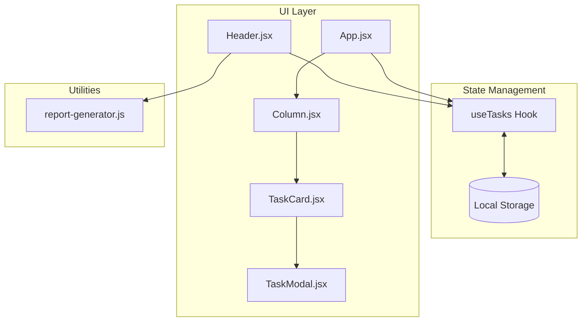
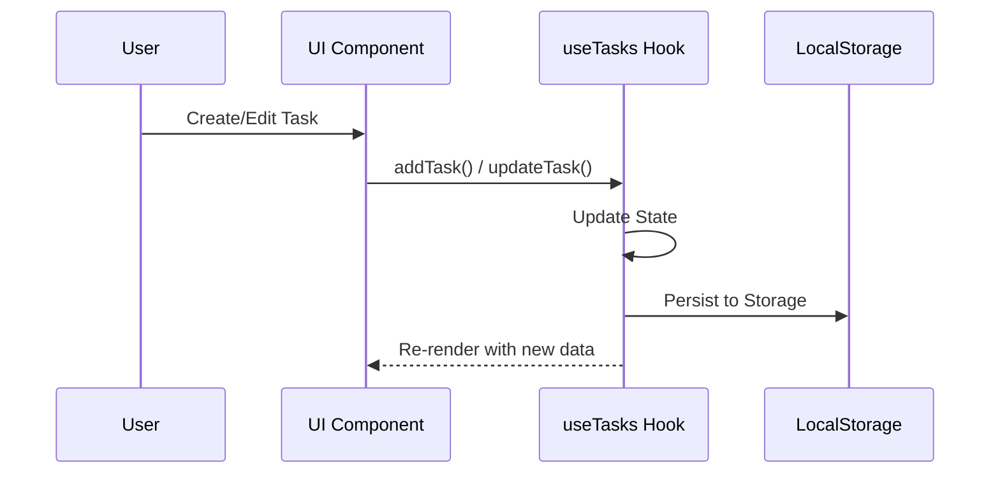

# 🚀 Premium Kanban Task Board

[](https://react.dev/)
[](https://vitejs.dev/)
[](https://tailwindcss.com/)
[](https://www.framer.com/motion/)
[](https://github.com/parallax/jsPDF)

A high-performance, premium SaaS-style Kanban board designed for maximum interactivity and visual excellence. Built with **React 19**, **Vite**, and **Tailwind CSS v4**, this application features glassmorphism, fluid animations, and a robust feature set for efficient task management.

---

## 🏗️ Architecture Design

The project follows a **Modular Component Architecture** with a **Centralized State Hook** for data management and persistence.



---

## 🔄 Project Flow & Logic

### 1. Initialization
When the app loads, `useTasks` initializes by reading from `localStorage`. If empty, it populates with default tasks.

### 2. Task Lifecycle


### 3. Reporting Flow
Users can trigger a **PDF Report** from the settings. The `report-generator.js` utility processes the current task state, calculates metrics (completed vs. pending), and generates a professional PDF document.

---

## 🛠️ Technology Stack

| Category | Technology | Purpose |
| --- | --- | --- |
| **Framework** |  | Core UI Library |
| **Build Tool** |  | Lightning-fast development |
| **Styling** |  | Modern Utility-First CSS |
| **Animations** |  | Smooth UI Transitions |
| **Interactions** |  | Drag & Drop Functionality |
| **Reporting** |  | Client-side PDF Generation |

---

## 📂 Project Structure

```bash
Kanban Task Board/
├── src/
│   ├── components/      # ✨ Pure & Interactive UI Components
│   │   ├── Column.jsx      # Task containers by status
│   │   ├── TaskCard.jsx    # Individual task display
│   │   ├── Header.jsx      # Navigation & Global Controls
│   │   └── TaskModal.jsx   # Create/Edit overlay
│   ├── hooks/           # ⚓ Business Logic & State
│   │   └── useTasks.js     # Centralized task management
│   ├── utils/           # 📦 Utility Functions
│   │   ├── local-storage.js # Persistence layer
│   │   └── report-generator.js # PDF logic
│   ├── styles/          # 🎨 Styling & Design Tokens
│   │   └── index.css       # Tailwind & Glassmorphism config
│   └── App.jsx          # 🏗️ Application Entry Point
└── public/              # 📢 Static Assets
```

---

## ✨ Key Features

- **🎯 Interactive Kanban Flow**: Manage tasks across `To Do`, `In Progress`, and `Done`.
- **🤏 Professional Drag & Drop**: Powered by `@dnd-kit` with sensor-based precision.
- **🌗 Dual-Tone Theme Engine**: 
  - Dynamic **Night Mode** and **Day Mode** toggle.
  - Custom glassmorphism effects tailored for both themes.
- **🔍 Advanced Search & Filter**:
  - Global searching by task title.
  - Multi-criteria filtering by priority and column status.
- **⚡ Global Shortcuts**: `Ctrl+K / Cmd+K` for instant search focus.
- **📊 Reporting System**: Generate detailed PDF analytics of your task board.
- **💾 Local Persistence**: All changes are automatically synced to `localStorage`.

---

## 🚀 Getting Started

### 1. Installation
```bash
npm install
```

### 2. Run Development
```bash
npm run dev
```

---

## ⌨️ Power User Shortcuts

| Shortcut | Action |
| --- | --- |
| `Ctrl + K` / `⌘ + K` | Focus Search Bar |
| `Esc` | Close Modals |
| `Enter` | Save Task (in Modal) |

---

## 💎 Design Philosophy

- **Glassmorphism**: Depth through blurs and translucent borders.
- **Performance**: Optimized re-renders through modular hooks.
- **Micro-interactions**: Hover feedback and fluid layout transitions.

---

Produced with Precision by **Antigravity** 🚀
